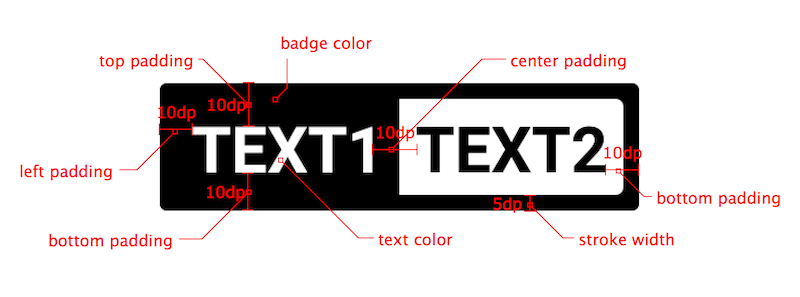

# Badge
[](http://www.apache.org/licenses/LICENSE-2.0.html) [](https://jitpack.io/#nekocode/Badge)

### Preview


## Using with gradle
- Add the JitPack repository to your root build.gradle:
```gradle
repositories {
    maven { url "https://jitpack.io" }
}
```

- Add the dependency to your sub build.gradle:
```gradle
dependencies {
    compile 'com.github.nekocode:Badge:{lastest-version}'
}
```
## Badge Types

This library provides four types of badges with cliche customizations.

| Type | Badge | Type | Badge |
| :----- | :------ | :----- | :------ |
| **`TYPE_NUMBER`** |  | **`TYPE_ONLY_ONE_TEXT`** |  |
| **`TYPE_TWO_TEXT`** |  | **`TYPE_TWO_TEXT_COMPLEMENTARY`** |  |

### Attributes



## Usage

The above screenshot's example:

```java
final BadgeDrawable drawable =
        new BadgeDrawable.Builder()
                .type(BadgeDrawable.TYPE_NUMBER)
                .number(9)
                .build();

final BadgeDrawable drawable2 =
        new BadgeDrawable.Builder()
                .type(BadgeDrawable.TYPE_ONLY_ONE_TEXT)
                .badgeColor(0xff336699)
                .text1("VIP")
                .build();

final BadgeDrawable drawable3 =
        new BadgeDrawable.Builder()
                .type(BadgeDrawable.TYPE_WITH_TWO_TEXT_COMPLEMENTARY)
                .badgeColor(0xffCC9933)
                .text1("LEVEL")
                .text2("10")
                .build();

final BadgeDrawable drawable4 =
        new BadgeDrawable.Builder()
                .type(BadgeDrawable.TYPE_WITH_TWO_TEXT)
                .badgeColor(0xffCC9999)
                .text1("TEST")
                .text2("Pass")
                .build();

final BadgeDrawable drawable5 =
        new BadgeDrawable.Builder()
                .type(BadgeDrawable.TYPE_NUMBER)
                .number(999)
                .badgeColor(0xff336699)
                .build();
```

The above `drawable4` BadgeDrawable has set a number that too large to show, in this case, it will be replaced with **"..."** for showing. And then you can use `toSpannable()` for converting the drawable to SpannableString without setting its drawing bounds. It has already took internal measure.

```java
SpannableString spannableString =
        new SpannableString(TextUtils.concat(
                "TextView ",
                drawable.toSpannable(),
                " ",
                drawable2.toSpannable(),
                " ",
                drawable3.toSpannable(),
                " ",
                drawable4.toSpannable(),
                " ",
                drawable5.toSpannable()
        ));

textView.setText(spannableString);
```

If the drawable's bounds was setted by manual or content view. It will auto cut the text to adjust the bounds' width. Look like:


You can also use the badge drawable for ImageView and other more view.
